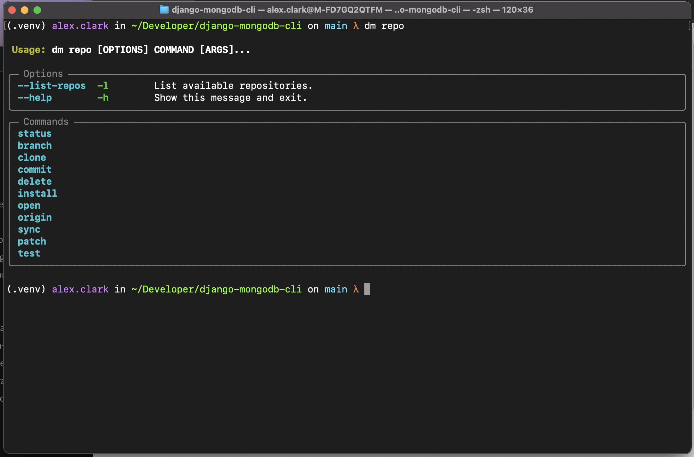
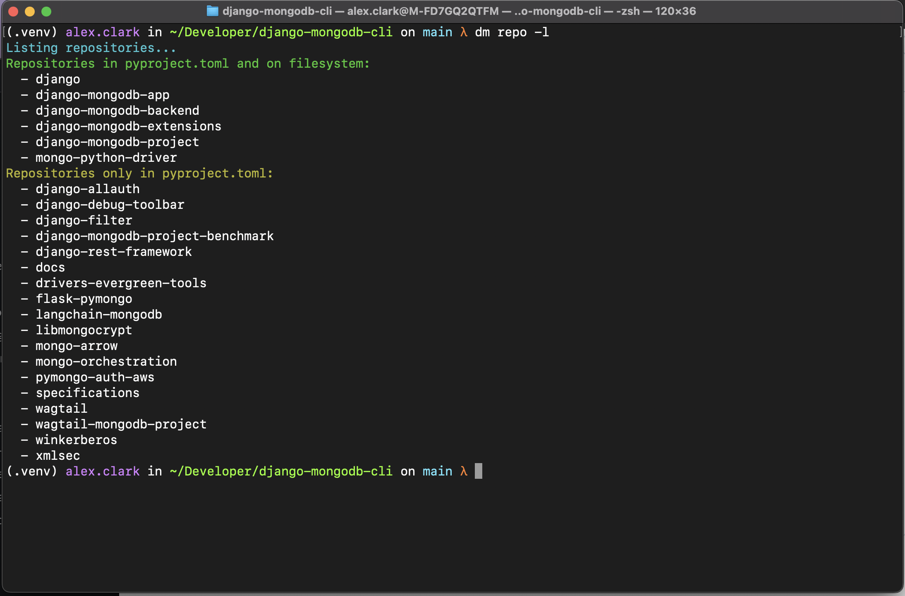
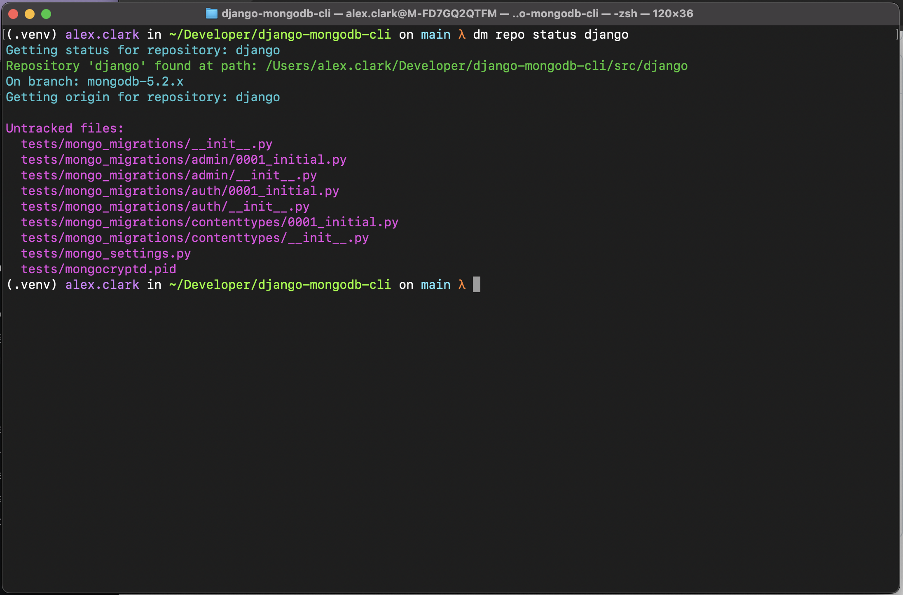

# django-mongodb-cli

## About

For testing [django-mongodb-backend](https://github.com/mongodb-labs/django-mongodb-backend)
with [MongoDB's Django fork](https://github.com/mongodb-forks/django) and [third party libraries](#third-party-libraries).

> [!NOTE]
> [MongoDB's Django fork](https://github.com/mongodb-forks/django) is for *testing* [django-mongodb-backend](https://github.com/mongodb-labs/django-mongodb-backend)
> and is not a requirement for *using* [django-mongodb-backend](https://github.com/mongodb-labs/django-mongodb-backend).

## Installation

```bash
git clone https://github.com/mongodb-labs/django-mongodb-cli
cd django-mongodb-cli
python -m venv .venv
source .venv/bin/activate
just install
```

## Usage

### Repository Groups

The `dm` CLI now supports organizing repositories into groups for easier management:

```bash
# List available groups
dm repo clone --list-groups

# Clone all repositories in a group
dm repo clone --group django --install

# Setup git remotes for a group
dm repo remote setup --group django

# Set default branch for all repos in a group
dm repo remote set-default --group django
```

You can also use the simplified just commands:

```bash
just git-clone django
just git-remote django
```

See the [documentation](docs/source/usage/repository-groups.rst) for more details.

### Screenshots




