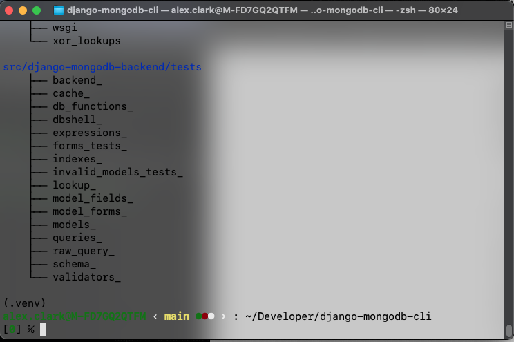
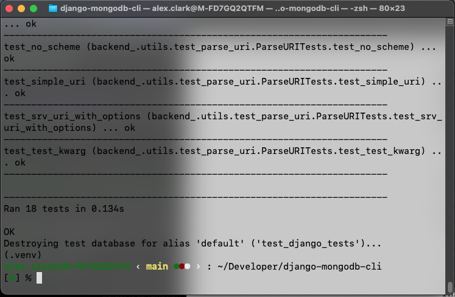

Run django-mongodb-backend tests
--------------------------------

The :ref:`Django fork <mongodb-django-fork>` test runner also runs
the django-mongodb-backend tests.

List tests
~~~~~~~~~~

You can list them with the
``dm repo test django -l`` command.

::

    dm repo test django -l

Run tests
~~~~~~~~~

Then you can run them by specifying the test module e.g. to run
the tests for the ``backend`` module::

    dm repo test django backend_

