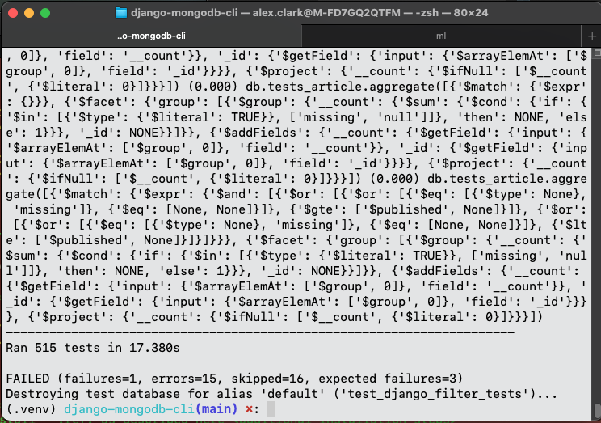
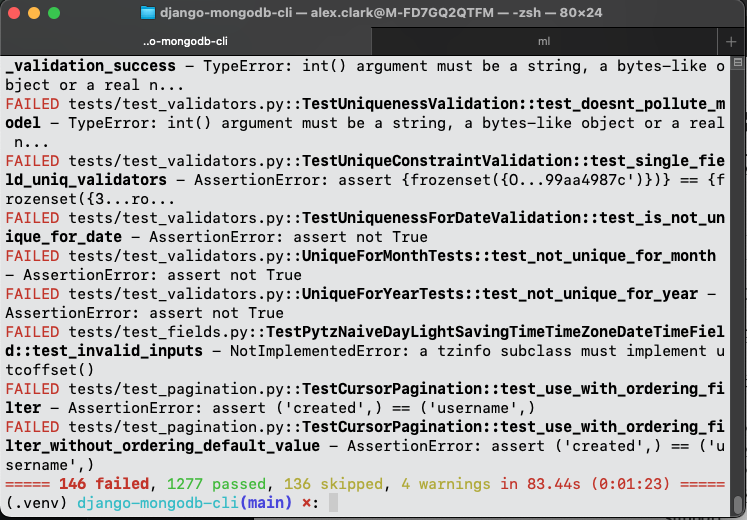
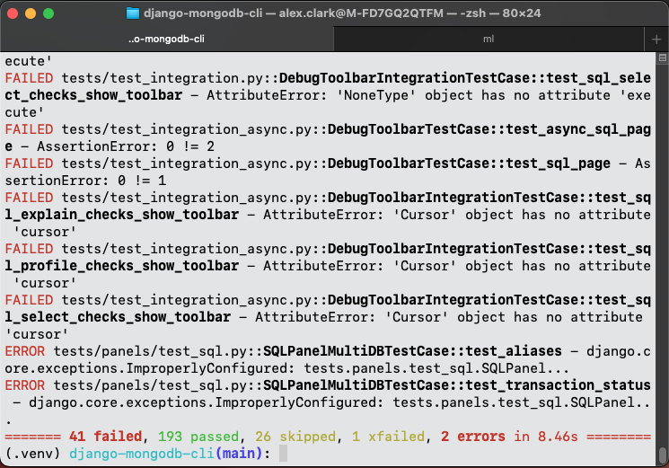
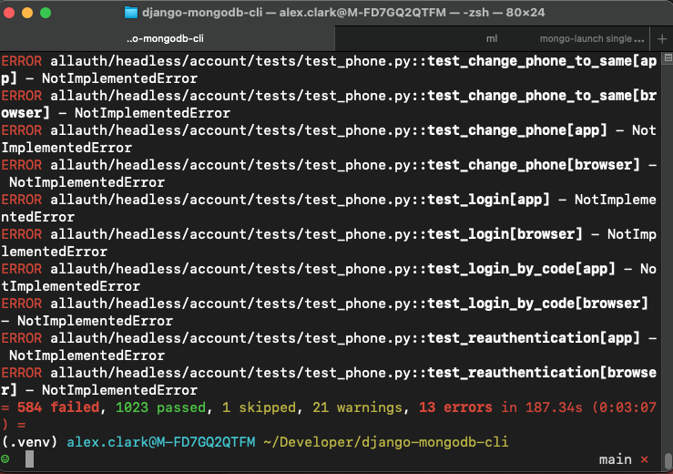
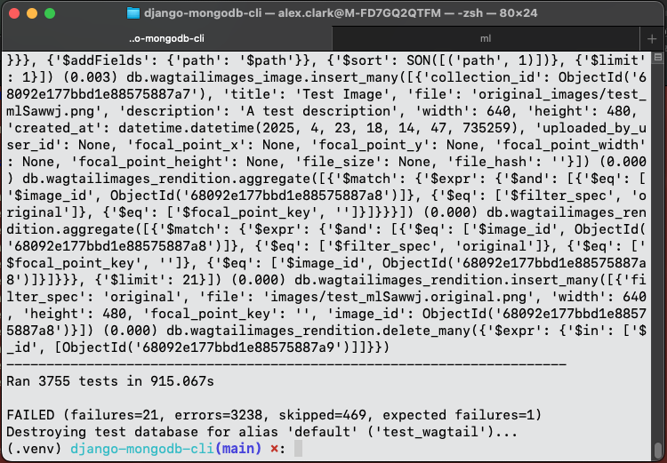

Run third-party library tests
-----------------------------

django-filter
~~~~~~~~~~~~~

::

    dm repo test django-filter

When completed successfully the output will look like this:

django-rest-framework
~~~~~~~~~~~~~~~~~~~~~

::

    dm repo test django-rest-framework

When completed successfully the output will look like this:

django-debug-toolbar
~~~~~~~~~~~~~~~~~~~~

::

    dm repo test django-debug-toolbar

When completed successfully the output will look like this:

django-allauth
~~~~~~~~~~~~~~

.. warning::

   If you install ``lxml`` and ``xmlsec`` via ``pip`` instead of
   ``just install`` :ref:`as described here <additional-installation-steps>`
   you may encounter test failures due to `issues like this one
   <https://github.com/xmlsec/python-xmlsec/issues/320>`_.

::

    dm repo test django-allauth

When completed successfully the output will look like this:

wagtail
~~~~~~~

::

    dm repo test wagtail

When completed successfully the output will look like this:

